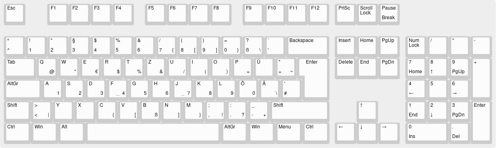

# Detox Keyboard Layout

The Detox keyboard layout makes numbers and special characters easier to reach which is especially
useful for programming tasks. It is based on the German keyboard layout and tries to preserve
backwards-compatibility in many cases. It does so by adding a third layer (1. lowercase,
2. uppercase, 3. numbers+special) which is activated with `AltGr` (and `CapsLock`, see below).

It follows these design principles:
* Remove `CapsLock`, use it as `AltGr` instead
* Numbers on `AltGr` + `home-row`
* Special characters (as far as possible) move one row down on `AltGr` + `QWERTZ-row`
* Exceptions:
  * `!` can't move to `Q` because we already have `@` there. Additionally, `?` should not move to `Ü` because that's not easier to reach. Therefore, `!` and `?` map to `,` and `.`
  * `§` is not mapped anywhere else because no-one has ever used it
  * `ß` and `ẞ` (capital `ß`) look similar to `B` :)
  * The remaining `\` is mapped on a slot similar to the US layout
  * The remaining `{`,`}` and `[`,`]` have occupied some of the left spots on the layout
* Finally, the modifiers `Shift` and `AltGr` are meant to be "latched". This means that you do not have to press the modifier simultaneously to the modified key. Instead, you just have to type it before (or at the same time). Typing the modifier twice locks the modifier (the well-known CapsLock behaviour) which can be reverted by typing it a third time.

## XKB mapping

To use, copy `detox` and `detoxLatchLevels` to `/usr/share/X11/xkb/symbols`.

Then, run `setxkbmap -layout detox -variant de`.

To install this layout for a desktop environment (tested with xfce), the `<layout>` item in `evdev.xml` starting in line 5673 has to be copied into the `<layoutList>` of `/usr/share/X11/xkb/symbols/evdev.xml`. This file is overridden whenever the according package is upgraded so this has to be done again after an upgrade.
